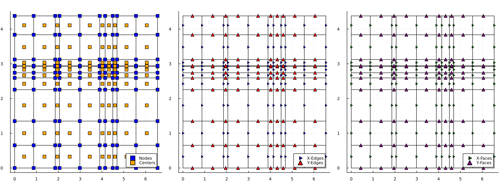

# CutCellMesh

## Overview
This repository contains tools for the generation of 1D, 2D and 3D structured meshes



Currently, CutCellMesh handles : 
- Cartesian Meshes (1D, 2D, 3D)

## Usage
```
# Test 1D
nx = 10
hx = ones(nx)
x0 = 0.0
mesh = CartesianMesh((hx,), (x0,))
p = plot_grid(mesh, act_nodes=true, act_centers=true, act_edges=true, act_faces=true)
display(p)

# Test 2D
nx, ny = 10, 10
hx, hy = [1.0*rand() for i in 1:nx], [1.0*rand() for j in 1:ny]
x0, y0 = 0.0, 0.0
mesh = CartesianMesh((hx, hy), (x0, y0))
center = centers(mesh)
p = plot_grid(mesh, act_nodes=true, act_centers=true, act_edges=true, act_faces=true)
display(p)
```

## Install
```
julia
] add https://github.com/JuliaxCutCell/CutCellMesh.jl
```

## ToDo
- AMR : Block-Structured, Point-wise (Quadtree)